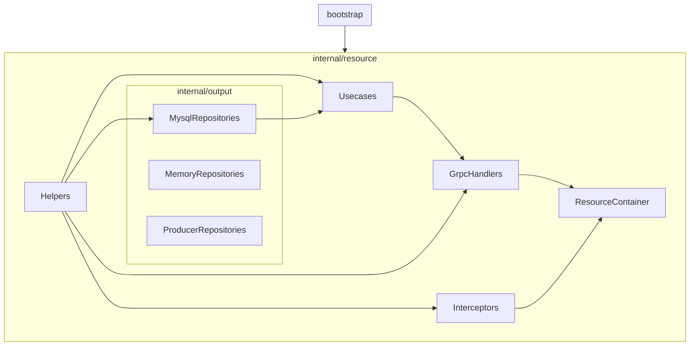

## 六角架構圖

+----------------------------------------------------------------+
|                            input                               |
|        HTTP / gRPC / CLI / Cron / WebSocket / GraphQL          |
+----------------------------------------------------------------+
                               |
                               v
                    +----------------------+
                    |     input_port       |
                    +----------------------+
                               ^
                               |
                    +----------------------+      +----------------------+
                    |                      |----->|                      |
                    |                      |      |                      |
                    |                      |      |                      |
                    |                      |      |        domain        |
                    |       use_case       |      |                      |
                    |                      |      |                      |
                    |                      |      |                      |
                    |                      |      |                      |
                    +----------+-----------+      +----------------------+
                               |
                               v
                    +----------------------+
                    |     output_port      |
                    +----------------------+
                               ^
                               |
+----------------------------------------------------------------+
|                            output                              |
|      MySQL / Redis / Kafka / S3 / MQ / Third-party API         |
+----------------------------------------------------------------+

## 六角架構核心優點
1. 可以同時輸入 http / grpc / cron / consumer / websocket / client-stream / command，但共用同一套 usecase 業務邏輯。
2. 每種輸入各自只組裝自己需要的依賴（見下方「每個服務獨立 container」），不會因為要跑 `cron` 就順便把 gRPC client、AMQP 都連上。

## 目錄結構

> 下面標「（孤兒）」的檔案／資料夾是目前 `wire.go` 完全沒有組裝到的死代碼——保留著方便參考寫法，
> 但不代表正在被任何服務使用；清不清、何時清由你決定，這份文件只負責如實反映現狀。

```
.
├── main.go                        # 進入點，只呼叫 cmd.Execute()
├── cmd/                           # cobra 指令，每個檔案對應一個可獨立啟動的服務／進程
│   ├── root.go                    #   root command，Execute() 供 main.go 呼叫
│   ├── facade.go                  #   啟動 facade gRPC 服務（對外入口）
│   ├── resource.go                #   啟動 resource gRPC 服務（資料服務，僅供 facade / http 呼叫）
│   ├── http.go                    #   啟動 HTTP（Gin）服務
│   ├── consumer.go                #   啟動 AMQP consumer
│   ├── client.go / socket.go      #   啟動 gRPC client-side stream 訂閱（目前容器是空殼，見下方）
│   ├── cron.go                    #   啟動排程服務
│   ├── websocket.go               #   啟動 websocket 服務（目前容器是空殼，見下方）
│   └── command.go                 #   啟動一次性 CLI 指令
│
├── internal/
│   ├── bootstrap/                 # 讀 CONFIG、建立各種基礎設施連線（mysql / redis / amqp / mongo / grpc client）
│   ├── domain/                    # 領域物件（entity），跟任何框架、資料庫無關
│   │   ├── admin_user.go          #   後台管理者，resource 服務 + http 登入在用
│   │   ├── app_user.go            #   一般使用者（含 Balance 餘額），cron/consumer/command 在用
│   │   └── user.go                #  （孤兒）舊的 User 垂直切面已整條拔掉，只剩這個型別沒人 import
│   ├── helper/                    # 通用工具（AES、RSA、JWT、Cache 讀寫……），跟業務邏輯無關可到處注入
│   ├── client/                    # 對外部 gRPC stream server / resource 服務的 client 封裝
│   │
│   ├── input/                     # 協議輸入端（driving adapter），只有實作，沒有介面
│   │   └── application/
│   │       ├── facade/            #   對外 gRPC 入口
│   │       │   ├── abstract_handler.go
│   │       │   ├── register/authenticator_handler.go  #  stub，還沒接 usecase
│   │       │   └── table/scanner_handler.go            #  stub，還沒接 usecase
│   │       ├── resource/          #   resource 內部 gRPC 服務（僅供 facade / http 呼叫）
│   │       │   ├── abstract_handler.go
│   │       │   └── model/admin_user_handler.go
│   │       ├── http/
│   │       │   ├── abstract_handler.go
│   │       │   └── admin/
│   │       │       ├── authentication/authenticator_handler.go  #  登入，唯一有接 usecase 的 http handler
│   │       │       └── resource/order_handler.go                #  空殼，預留
│   │       ├── client/            #   gRPC client（訂閱外部 stream）—— ClientContainer 目前沒有任何
│   │       │                      #   handler 掛上去，`client` 指令啟動後是空跑
│   │       │   ├── abstract_handler.go
│   │       │   └── admin/resource/app_user_handler.go  #（孤兒）沒被 wire 組裝
│   │       ├── consumer/          #   AMQP consumer handler
│   │       │   ├── abstract_handler.go     #   帶 amqp.Connection，ConsumerContainer 直接內嵌它
│   │       │   └── admin/resource/
│   │       │       ├── app_user_handler.go #   訂閱 queue "AppUser.IncreaseBalance"
│   │       │       └── order_handler.go    #   空殼，預留
│   │       ├── cron/              #   排程任務 handler
│   │       │   ├── abstract_handler.go
│   │       │   └── admin/resource/app_user_handler.go  # 每分鐘觸發一次 IncreaseBalance(id=1, amount=10)
│   │       ├── websocket/         #   websocket handler —— WebsocketContainer 目前沒有任何 handler，
│   │       │   └── abstract_handler.go                  #   `websocket` 指令啟動後只開 port，不處理任何連線
│   │       └── command/           #   CLI 指令 handler
│   │           ├── abstract_handler.go
│   │           └── admin/resource/app_user_handler.go   # `command AppUser-IncreaseBalance --id --amount`
│   │       （每個 adapter 底下都有自己獨立的 abstract_handler.go，彼此不共用；
│   │        adapter 內部依 leaf 功能再分 admin/resource、admin/authentication 這種子資料夾，
│   │        單純是模仿 http 那條路徑的分法，跟權限、後台與否無關）
│   │
│   ├── middleware/
│   │   └── admin/                 # HTTP 專用 middleware 鏈（logger / signature / decryption / encryption / error ...）
│   │
│   ├── interceptor/                # gRPC 專用攔截器鏈，對應 facade / resource 兩種 server
│   │   ├── facade/game/
│   │   └── resource/
│   │
│   ├── usecase/                   # 商務案例：實作 + 端口介面
│   │   ├── application/
│   │   │   └── any/               #  「any」表示這份 usecase 不綁定特定 adapter，可以被多個 driving
│   │   │                          #   adapter 共用（同一份業務規則、不同觸發管道）；子資料夾用「功能」
│   │   │                          #   命名，不是用 adapter 命名
│   │   │       ├── admin/authentication/  #  AuthenticatorUsecase：目前只有 http 登入在用
│   │   │       ├── admin/resource/        #  AppUserUsecase.IncreaseBalance：cron / consumer / command
│   │   │       │                          #  三個 adapter 共用同一份實作
│   │   │       ├── model/                 #  AdminUserUsecase：resource 服務內部專用（直接讀 mysql）
│   │   │       ├── logic/                 #  （孤兒）AppUserUsecase.AddAppUser，簽名還有型別抄錯的舊 bug
│   │   │       └── game/ register/ table/ #  （孤兒）只有空的 abstract_usecase.go，預留骨架
│   │   └── port/
│   │       └── any/               #  對應上面每一組的 interface，同樣用「功能」命名
│   │           ├── admin/authentication/
│   │           ├── admin/resource/
│   │           ├── model/
│   │           └── logic/         #  （孤兒）
│   │
│   ├── output/                    # 輸出端（driven adapter）：實作 + 端口介面
│   │   ├── application/
│   │   │   ├── mysql/model/       #   AbstractRepository（*gorm.DB） / AdminUserRepository /
│   │   │   │                      #   AppUserRepository，resource、consumer、cron、command 都在用
│   │   │   ├── resource/model/    #   AdminUserRepository，透過 gRPC ResourceClient 呼叫 resource 服務
│   │   │   │                      #   （http 登入用這份，不直接連 DB）
│   │   │   ├── resource/logic/    #  （孤兒）AppUserRepository，內容是寫死的假資料，沒有真的打 gRPC
│   │   │   └── producer/model/    #  （孤兒）AMQP UserProducer，舊 User 切面拔掉後沒人呼叫
│   │   └── port/
│   │       └── any/               #  跟 usecase/port/any 一樣的命名邏輯：這裡的「介面」不分誰在用，
│   │           ├── model/         #   UserRepository（孤兒）/ AdminUserRepository / AppUserRepository
│   │           └── logic/         #  （孤兒）AppUserRepository
│   │
│   ├── register/                  # 組裝層：把 container 生好的 handler 註冊到對應的 server/router
│   │                                #   （grpc.RegisterXxxServer / gin.Group / cron.AddFunc ...），
│   │                                #   cmd/ 只管呼叫 XxxInit 拿到 server 物件再 Serve，不碰組裝細節
│   │
│   └── container/                 # wire 組裝根：wire.go 手寫、wire_gen.go 自動產生，別手改後者
│       （每個服務各自一個 Container + InitXxxContainer：FacadeContainer / ResourceContainer /
│        HttpContainer / ConsumerContainer / CronContainer / WebsocketContainer /
│        ClientContainer / CommandContainer；Websocket、Client 目前是空殼容器，
│        只裝了 Helper，沒有任何業務 handler）
│
├── pkg/                            # 跟 domain 無關、可重用的通用元件
│   ├── logger.go                    #   pkg.Logger(pkg.Controller / .Middleware / .Cron / .Consumer ...)
│   │                                 #   依業務模組分類、依 level 拆檔案（runtime/log/<module>/）+ console 輸出
│   ├── consumer_router.go           #   queue name -> handler 的路由表（AMQP 沒有內建路由機制）
│   ├── client_router.go             #   多個 client-side 訂閱方法的並行啟動器
│   ├── websocket_router.go          #   websocket 路由的路徑前綴分組（模仿 gin Group）
│   ├── cache.go                     #   Redis 快取讀寫封裝
│   ├── response.go                  #   統一 HTTP 回應格式
│   ├── default_error.go             #   統一錯誤結構
│   └── aop.go                       #   泛型 Cacheable / CachePut / CacheEvict，AOP 風格的快取包裝
│
├── config/                         # viper 讀取的 yaml 設定檔，一個檔案對應一個頂層命名空間
│   ├── services.yaml                #   各服務監聽 port（http / facade / resource / websocket）
│   ├── clients.yaml                 #   對外部服務的 client 連線設定
│   ├── database.yaml / mongodb.yaml / redis.yaml / amqp.yaml
│   ├── loggers.yaml                 #   pkg.Logger 各分類（default/controller/middleware/...）的目錄與輪替設定
│   └── ...                          #   admin / app / third / table / partitions / default
│
├── proto/                          # protobuf 原始定義（facade/ 對外、resource/ 資料服務、client/ 外部訂閱）
└── pb/                             # protoc 產生的程式碼，對應 proto/ 底下的定義
```


## DI 依賴注入樹狀圖（ResourceContainer）

說明：`A --> B` 代表 A 被注入到 B（A 是 B 的建構依賴），ResourceContainer 為最底層、最終組裝出來的容器。



文字版（由下往上）：
```
┌ bootstrap ──┐
│             ├─────┐
└──────┬──────┘     │
       ▼            │
┌ pkg ────────┐     │
│             │     │
└──────┬──────┘     │
       │            │
       │            │
       │            │
       ▼            ▼
┌ internal/resource ──────────────────────────────────────────────────────────────────────────────────────────────────┐
│                                                    ┌─────────┐                                                      │
│    ┌───────────────────────────────────────────────┤ Helpers ├───────────────────────────────────────────────────┐  │
│    │                                               └────┬────┘                                                   │  │
│    │                                                    │                                                        │  │
│    │                                                    │                                                        │  │
│    │  ┌┄┄┄┄┄┄┄┄┄┄┄┄┄┄┄┐                                 │                                                        │  │
│    │  ┆               ┆                                 ▼                                                        │  │
│    │  ┆           ┌ internal/output ──────────────────────────────────────────────────────────┐                  │  │
│    │  ┆           │ ┌─────────────────────┐  ┌─────────────────────┐  ┌─────────────────────┐ │                  │  │
│    │  ┆           │ │  Mysql/Reposities   │  │  Memory/Reposities  │  │ Producer/Reposities │ │                  │  │
│    │  ┆           │ └──────────┬──────────┘  └──────────┬──────────┘  └──────────┬──────────┘ │                  │  │
│    │  ┆           └───────────────────────────────────────────────────────────────────────────┘                  │  │
│    │  ┆               ▲                                 │                                                        │  │
│    │  └┄┄┄┄┄┄┄┄┄┄┄┄┄┄┄┘                                 ▼                                                        │  │
│    │                                              ┌───────────┐                                                  │  │
│    │                                              │  Usecases │◀─────────────────────────────────────────────────┘  │
│    │                                              └─────┬─────┘                                                     │
│    │                                                    │                                                           │
│    │                                                    │                                                           │
│    │                                                    ▼                                                           │
│    └───────────────────────────────────────────┬────────┴──────────┐                                                │
│                                                │                   │                                                │
│                                                ▼                   ▼                                                │
│                                      ┌─────────────────┐  ┌──────────────────┐                                      │
│                                      │   GrpcHandlers  │  │   Interceptors   │                                      │
│                                      └────────┬────────┘  └─────┬────────────┘                                      │
│                                               │                 │                                                   │
│                                               └────────┬────────┘                                                   │
│                                                        ▼                                                            │
│                                              ┌─────────────────────┐                                                │
│                                              │  ResourceContainer  │                                                │
│                                              └─────────────────────┘                                                │
└─────────────────────────────────────────────────────────────────────────────────────────────────────────────────────┘


```


## 服務拓樸

- **facade**：對外 gRPC 入口，`register` / `table` 兩個 handler 目前是 stub，還沒接 usecase。
- **resource**：內部資料服務，直接讀寫 mysql，僅供 facade / http 呼叫（`AdminUserUsecase` 專屬於這條路徑，走 `usecase/application/any/model`）。
- **http**：Gin REST API，目前只有 `Admin/Authentication/Authenticator/SignIn` 這個登入端點，走專屬的 `AuthenticatorUsecase`（`usecase/application/any/admin/authentication`），透過 gRPC 呼叫 resource 服務查帳號。
- **cron / consumer / command**：三個週邊輸入來源，各自觸發「幫 AppUser 加餘額」，共用同一份 `AppUserUsecase.IncreaseBalance`（`usecase/application/any/admin/resource`），底層都是直接打 mysql。三者差異只在參數怎麼來：cron 排程寫死、consumer 解 MQ payload、command 吃 CLI flag。
- **websocket / client**：容器都還在，但目前沒有掛任何 handler，指令啟動後不會處理任何請求（是之前拿掉舊 `User` 垂直切面後留下的空殼，等有新需求再補）。

依賴方向永遠是「外層指向內層」：`input adapter → usecase/port → usecase → output/port ← output adapter`，
`usecase` 完全不知道自己被 http 還是 grpc 還是 cron 呼叫，也不知道資料到底存在 mysql 還是走 gRPC 轉發。


## 如何 watch 开发
1. go mod 安装下载 air 套件
```zsh
go install github.com/air-verse/air@latest
```


## 代碼開發流程(以 Http 為例子)
1. input：建立新的 Http handlers，註冊到 container，container 再註冊到路由上
2. usecase：建立新的 usecase/application/any/<功能> + usecase/port/any/<功能>，把實作註冊到 container，修改 Http handlers 讓 usecase（port）注入
   - 命名用「功能」不是用「adapter 名稱」：如果這個 usecase 未來可能被其他 adapter（cron/consumer/command...）共用，直接放 any 底下就好，不用每個 adapter 各生一份
3. output：建立新的 output/application/mysql/model + output/port/any/model，把實作註冊到 container，修改 usecase 讓 repo-port 注入
*. 如果 container 首次增加 mysql 需要注入 bootstrap.NewMysql 