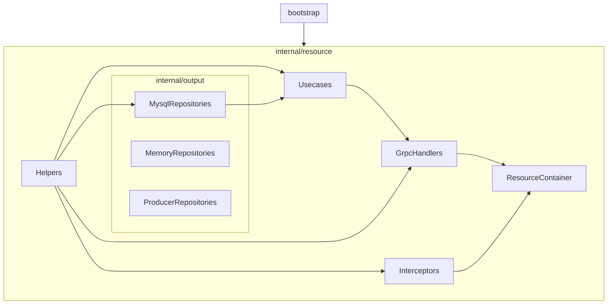

## 六角架構圖

+----------------------------------------------------------------+
|                            input                               |
|        HTTP / gRPC / CLI / Cron / WebSocket / GraphQL          |
+----------------------------------------------------------------+
                               |
                               v
                    +----------------------+
                    |     input_port       |
                    +----------------------+
                               ^
                               |
                    +----------------------+      +----------------------+
                    |                      |----->|                      |
                    |                      |      |                      |
                    |                      |      |                      |
                    |                      |      |        domain        |
                    |       use_case       |      |                      |
                    |                      |      |                      |
                    |                      |      |                      |
                    |                      |      |                      |
                    +----------+-----------+      +----------------------+
                               |
                               v
                    +----------------------+
                    |     output_port      |
                    +----------------------+
                               ^
                               |
+----------------------------------------------------------------+
|                            output                              |
|      MySQL / Redis / Kafka / S3 / MQ / Third-party API         |
+----------------------------------------------------------------+

## 六角架構核心優點
1. 可以同時輸入 http / grpc / cron / consumer / websocket / client-stream / command，但共用同一套 usecase 業務邏輯。
2. 每種輸入各自只組裝自己需要的依賴（見下方「每個服務獨立 container」），不會因為要跑 `cron` 就順便把 gRPC client、AMQP 都連上。

## 目錄結構

```
.
├── main.go                        # 進入點，只呼叫 cmd.Execute()
├── cmd/                           # cobra 指令，每個檔案對應一個可獨立啟動的服務／進程
│   ├── root.go                    #   root command，Execute() 供 main.go 呼叫
│   ├── facade.go                  #   啟動 facade gRPC 服務（對外入口）
│   ├── resource.go                #   啟動 resource gRPC 服務（資料服務，僅供 facade 呼叫）
│   ├── http.go                    #   啟動 HTTP（Gin）服務
│   ├── consumer.go                #   啟動 AMQP consumer
│   ├── client.go / socket.go      #   啟動 gRPC client-side stream 訂閱
│   ├── cron.go                    #   啟動排程服務
│   ├── websocket.go               #   啟動 websocket 服務
│   └── command.go                 #   啟動一次性 CLI 指令（走記憶體 repository，不連 MySQL/Redis）
│
├── internal/
│   ├── bootstrap/                 # 讀 CONFIG、建立各種基礎設施連線（mysql / redis / amqp / mongo / grpc client）
│   ├── domain/                    # 領域物件（entity），跟任何框架、資料庫無關
│   ├── helper/                    # 通用工具（AES、RSA、Cache 讀寫……），跟業務邏輯無關可到處注入
│   ├── client/                    # 對外部 gRPC stream server 的 client 封裝
│   │
│   ├── input/                     # 協議輸入端的 - 只有實作
│   │   └── application/           # 實作  
│   │       ├── facade/            #   
│   │       ├── resource/          #   resource gRPC server handler（model/admin_user_handler.go）
│   │       ├── http/
│   │       │   └── admin/         #   HTTP handler（含 authentication、resource 子路由）
│   │       │       ├── authentication/
│   │       │       └── resource/
│   │       ├── client/            #   gRPC client（訂閱外部 stream）
│   │       ├── consumer/          #   AMQP consumer handler
│   │       ├── cron/              #   排程任務 handler
│   │       ├── websocket/         #   websocket handler
│   │       └── command/           #   CLI 指令 handler（走記憶體 repository）
│   │       （每個 adapter 底下都有自己獨立的 abstract_handler.go，彼此不共用，
│   │        只共用 usecase 這個核心業務邏輯）
│   │
│   ├── middleware/
│   │   └── admin/                 # HTTP 專用 middleware 鏈（logger / signature / decryption / encryption / error ...）
│   │
│   ├── usecase/                   # 商務案例 ：實作 + 端口介面 （目錄結構命名按照 “路由”區分）
│   │   ├── application/           # 實作
│   │   │   ├── facade/
│   │   │   │   └── model/         #   UserUsecase（facade 跟其他週邊 adapter 共用）
│   │   │   ├── http/
│   │   │   │   └── admin/
│   │   │   │       └── authentication/  #   http 登入專用的 AdminUserUsecase
│   │   │   └── resource/
│   │   │       ├── model/         #   resource 服務專屬的 AdminUserUsecase
│   │   │       └── logic/         #   AppUserUsecase（第一個真的用到 logic/ 的例子）
│   │   └── port/                  #  端口介面
│   │       ├── facade/
│   │       │   └── model/         #  
│   │       ├── http/
│   │       │   └── admin/
│   │       │       └── authentication/  #   AdminUserUsecase 介面（http 專用）
│   │       └── resource/
│   │           ├── model/         #   AdminUserUsecase 介面（resource 服務專屬）
│   │           └── logic/         #   AppUserUsecase 介面
│   │   （這裡的 model/ 跟 output/ 底下的 model/ 是同一套命名慣例：
│   │    model/ 代表單一資源的輸出，logic/ 代表多種資源的輸出——
│   │    resource/logic/ 底下的 AppUserUsecase 是目前唯一真的落地的 logic/ 範例，
│   │    其他都還是 model/）
│   │   （facade/model 底下的 UserUsecase 是 facade 跟其他週邊 adapter 共用的；
│   │    resource/model 底下的 AdminUserUsecase 才是 resource 服務專屬；
│   │    http/admin/authentication 則是另外獨立、只給 http 登入用的第三份——
│   │    三者商業邏輯差異大，故意不共用同一個 AbstractUsecase，這是歷史命名，
│   │    
│   │
│   ├── output/                    #  輸出部分：包含「實作」跟「介面」：
│   │   ├── application/           #  「實作」：
│   │   │                          #   - model/：代表單一資源的輸出，一次呼叫只對應一個底層資源（如單純寫 DB、單純發一筆訊息）
│   │   │                          #   - logic/：代表多種資源的輸出，介面上看起來是一次呼叫，實際上內部
│   │   │                          #     關聯、協調多個資源（如 cache 裝飾器要同時處理 mysql 寫入 + redis 快取失效）
│   │   │                          #   目前多數 adapter 的 logic/ 還只是預留空資料夾（gitkeep），
│   │   │                          #   resource/logic/ 已經有真的實作可以參考（見下方）
│   │   │   ├── mysql/
│   │   │   │   └── model/         #   MySQL 實作（gorm）
│   │   │   ├── cache/
│   │   │   │   └── model/         #   裝飾器（Decorator），包住 mysql 實作，加上 redis 讀寫快取
│   │   │   ├── memory/
│   │   │   │   └── model/         #   記憶體實作，只給 `command` 這個輕量 CLI 用
│   │   │   ├── producer/
│   │   │   │   └── model/         #   AMQP 訊息生產者實作（UserProducer）
│   │   │   └── resource/
│   │   │       ├── model/         #  單一數據輸出（譬如一個 entity 的修改）
│   │   │       └── logic/         #  複雜數據輸出（譬如多個 entity 的修改）
│   │   └── port/                  # 「介面」：
│   │       └── any/
│   │           ├── model/         #   UserRepository / AdminUserRepository 介面（driven port）
│   │           └── logic/         #   AppUserRepository 介面
│   │       （介面本身不分 model/logic 的資料夾意義——不管底下是單一輸出還是組合型輸出，
│   │        usecase 依賴的都是同一份介面規則，所以叫 any；只是實際內容還是分開放，
│   │        對應各自的 output/application/<adapter>/model 或 logic）
│   │
│   ├── register/                  # 組裝層：把 container 生好的 handler 註冊到對應的 server/router
│   │                                #   （grpc.RegisterXxxServer / gin.Group / cron.AddFunc ...），
│   │                                #   cmd/ 只管呼叫 XxxInit 拿到 server 物件再 Serve，不碰組裝細節
│   │
│   └── container/                 # wire 組裝根：wire.go 手寫、wire_gen.go 自動產生，別手改後者
│       （每個服務各自一個 Container + InitXxxContainer：FacadeContainer / ResourceContainer /
│        HttpContainer / ConsumerContainer / CronContainer / WebsocketContainer /
│        ClientContainer / CommandContainer）
│
├── pkg/                            # 跟 domain 無關、可重用的通用元件
│   ├── logger.go                    #   pkg.Logger(pkg.Controller / .Middleware / .Cron / .Consumer ...)
│   │                                 #   依業務模組分類、依 level 拆檔案（runtime/log/<module>/）+ console 輸出
│   ├── consumer_router.go           #   queue name -> handler 的路由表（AMQP 沒有內建路由機制）
│   ├── client_router.go             #   多個 client-side 訂閱方法的並行啟動器
│   ├── websocket_router.go          #   websocket 路由的路徑前綴分組（模仿 gin Group）
│   ├── cache.go                     #   Redis 快取讀寫封裝
│   ├── response.go                  #   統一 HTTP 回應格式
│   ├── default_error.go             #   統一錯誤結構
│   └── aop.go                       #   泛型 Cacheable / CachePut / CacheEvict，AOP 風格的快取包裝
│
├── config/                         # viper 讀取的 yaml 設定檔，一個檔案對應一個頂層命名空間
│   ├── services.yaml                #   各服務監聽 port（http / facade / resource / websocket）
│   ├── clients.yaml                 #   對外部服務的 client 連線設定
│   ├── database.yaml / mongodb.yaml / redis.yaml / amqp.yaml
│   ├── loggers.yaml                 #   pkg.Logger 各分類（default/controller/middleware/...）的目錄與輪替設定
│   └── ...                          #   admin / app / third / table / partitions / default
│
├── proto/                          # protobuf 原始定義（facade/ 對外、resource/ 資料服務、client/ 外部訂閱）
└── pb/                             # protoc 產生的程式碼，對應 proto/ 底下的定義
```


## DI 依賴注入樹狀圖（ResourceContainer）

說明：`A --> B` 代表 A 被注入到 B（A 是 B 的建構依賴），ResourceContainer 為最底層、最終組裝出來的容器。



文字版（由下往上）：
```
┌ bootstrap ──┐
│             ├─────┐
└──────┬──────┘     │
       ▼            │
┌ pkg ────────┐     │
│             │     │
└──────┬──────┘     │
       │            │
       │            │
       │            │
       ▼            ▼
┌ internal/resource ─────────────────────────────────────────────────────────────────────────────────────────────────────────────────┐
│                                                            ┌─────────┐                                                             │
│    ┌───────────────────────────────────────────────────────┤ Helpers ├─────────────────────────────────────────────────────────┐   │
│    │                                                       └────┬────┘                                                         │   │
│    │                                                            │                                                              │   │
│    │                                                            │                                                              │   │
│    │                                                            │                                                              │   │
│    │                                                            ▼                                                              │   │
│    │        ┌┄┄┄┄┄┄┄┄┄┄┄┄┄┌ internal/output ──────────────────────────────────────────────────────────┐                        │   │
│    │        ┆             │ ┌─────────────────────┐  ┌─────────────────────┐  ┌─────────────────────┐ │                        │   │
│    │        ┆             │ │  Mysql/Reposities   │  │  Memory/Reposities  │  │ Producer/Reposities │ │                        │   │
│    │        ┆             │ └──────────┬──────────┘  └──────────┬──────────┘  └──────────┬──────────┘ │                        │   │
│    │        └┄┄┄┄┄┄┄┄┄┄┄┄▶└───────────────────────────────────────────────────────────────────────────┘                        │   │
│    │                                                            │                                                              │   │
│    │                                                            ▼                                                              │   │
│    │                                                      ┌───────────┐                                                        │   │
│    │                                                      │  Usecases │◀───────────────────────────────────────────────────────┘   │
│    │                                                      └─────┬─────┘                                                            │
│    │                                                            │                                                                  │
│    │                                                            │                                                                  │
│    │                                                            ▼                                                                  │
│    └───────────────────────────────────────────────────┬────────┴──────────┐                                                       │
│                                                        │                   │                                                       │
│                                                        ▼                   ▼                                                       │
│                                               ┌─────────────────┐  ┌──────────────────┐                                            │
│                                               │   GrpcHandlers  │  │   Interceptors   │                                            │
│                                               └────────┬────────┘  └─────┬────────────┘                                            │
│                                                        │                 │                                                         │
│                                                        └────────┬────────┘                                                         │
│                                                                 ▼                                                                  │
│                                                      ┌─────────────────────┐                                                       │
│                                                      │  ResourceContainer  │                                                       │
│                                                      └─────────────────────┘                                                       │
└────────────────────────────────────────────────────────────────────────────────────────────────────────────────────────────────────┘


```


## 服務拓樸

- **facade**：對外 gRPC 入口（game / register / table），驗證身份後呼叫 usecase。
- **resource**：內部資料服務，直接讀寫 DB，僅供 facade 呼叫（`AdminUserUsecase` 專屬於這條路徑）。
- **http**：Gin REST API，走跟 facade 相同的 `UserUsecase`。
- **consumer / cron / websocket / client**：週邊輸入來源，各自訂閱不同來源的事件，一樣共用 `UserUsecase`。
- **command**：一次性 CLI 工具，刻意繞過 MySQL/Redis，改用 `output/application/memory` 的記憶體 repository，方便本機測試不需要起資料庫。

依賴方向永遠是「外層指向內層」：`input adapter → usecase/port → usecase → output/port ← output adapter`，
`usecase` 完全不知道自己被 http 還是 grpc 還是 cron 呼叫，也不知道資料到底存在 mysql 還是 redis 還是記憶體。


## 如何 watch 开发
1. go mod 安装下载 air 套件
```zsh
go install github.com/air-verse/air@latest
```


